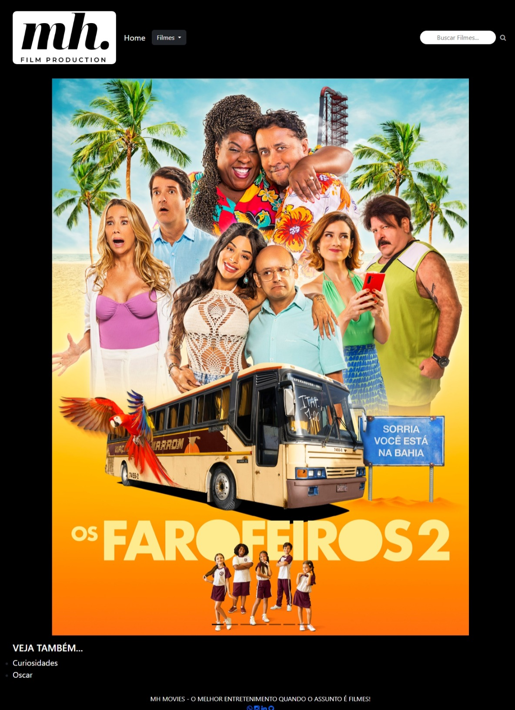

# Trabalho Prático - Semana 04 e 05

Dessa vez, vamos dar sequência ao projeto iniciado na semana passada. Se você ainda não fez o projeto da semana anterior, fique atento, se programe e procure colocar as atividades em dia. Volte lá, leia tudo e faça sua parte pois essa atividade depende da atividade anterior..

Nessa atividade,vamos evoluir o projeto para que a home-page funcione bem tanto no celular quanto no desktop, entendendo também como é o processo gradativo e colaborativo de desenvolvimento de um software, registrando cada etapa no histórico de commits do repositório do git/GitHub..

**IMPORTANTE:** Você deve trabalhar e alterar apenas arquivos dentro da pasta **`public`**. Deixe todos os demais arquivos e pastas desse repositório inalterados. **PRESTE MUITA ATENÇÃO NISSO.**

## Informações Gerais

- Nome: Matheus Henrique Borges Ferreira
- Matricula: 881020
- Proposta de projeto escolhida: Catálogo de Filmes
- Breve descrição sobre seu projeto: Desenvolvimento de duas formas do site, uma através de um CSS puro, adaptável a outros dispositivos e rico em informação, na segunda forma, algo mais simples, porém chamativo, com um carrossel centralizado, convidando o usuário para uma "noite de pipoca"!

## Print da versão responsiva com CSS puro

<<  COLOQUE A IMAGEM AQUI >>

## Print da versão responsiva com Bootstrap

<<  COLOQUE A IMAGEM AQUI >>
